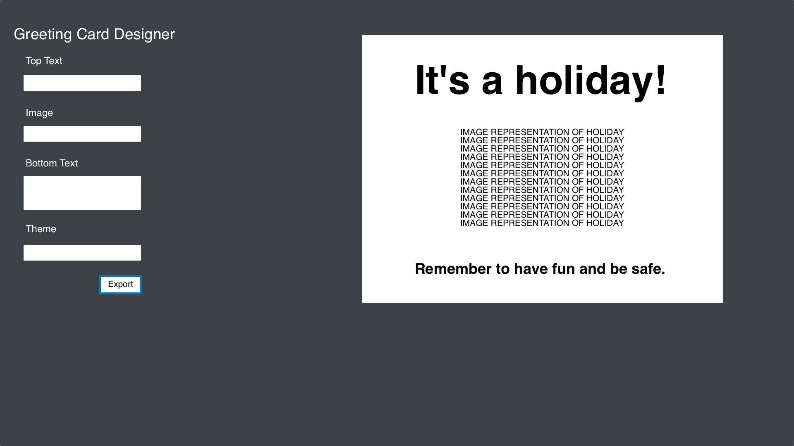

# Greeting Card Designer

## Page Design

The page will have two sections:

1. A "designer" section that will contain various inputs for the user to affect the card design and a button that will let the user export the finished card as an image.
2. A presentation section where the user can see the card in progress.

## State

All of the inputs in the design section will need to be synced into the presentation section. The planned inputs are:

1. A text type input for the card's heading or top text.
2. An image select dropdown for the card face image.
3. A textarea input for the card's main content or bottom text.
4. A theme select dropdown for selecting pre-designed themes.

Additionally, we will need to respond to the user pressing the export button. This should spin off an image download without affecting the app's state.

## Events

* `click` for the export button.
* `input` for text and textarea.
* `change` for dropdowns.

---
\
&nbsp;
# Original Prompt

## The Golden Rule:

🦸 🦸‍♂️ `Stop starting and start finishing.` 🏁

1. Limit Work in Progress (WIP)
1. Validate each line of code before moving forward
1. Keep it Simple Simon (KISS)

## Making a plan

1. Make a drawing of your app. **Simple "wireframes"**
1. Once you have a drawing, **name the HTML elements** you'll need to realize your vision**
1. For each HTML element ask: **Why do I need this?**
    - Does this element need **static content**, or is the content **dynamic state**?
    - If **state** where is the source of truth?
1. **Find all the 'events'** (user clicks, form submit, on load etc) in your app. Ask one by one, "What happens when" for each of these events. Does any state change?
1. Once we know the _why_ of elements, state, and events -- think about how to implement the "Why" as a "How"
1. Think about how to **validate each of your features** according to a Definition of Done
1. Consider what features **_depend_ on what other features**. Use this dependency logic to figure out what order to complete tasks.
